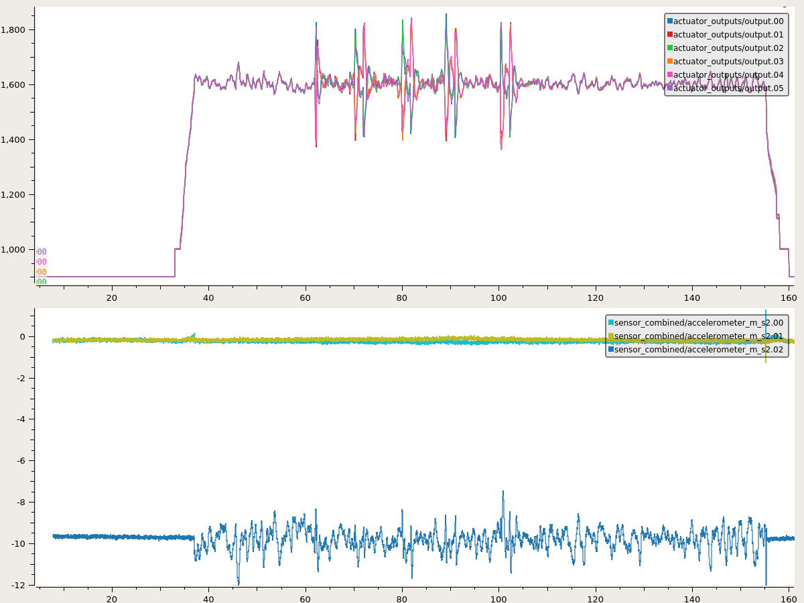

# JSBSim Brushless DC Motor (BLDC) Propulsion Modeling & Test
## Brushless DC propulsion modeling for use in sUAS modeling
Matt Vacanti
11/29/2020 

## Challenges with Existing Configuration
As of writing, the existing JSBSim model for an electric engine combined with the propeller thruster is appropriate in many 
cases but introduces undesirable characteristics when applied to small (<55 lbs) multi-copter UAS. 
This analysis explores contributing factors, makes recommendations, and provides test 
configurations to replicate the results. The analysis will investigate the following areas: 

- 
- 
- 
- 

## Baseline Configuration
Configuration | Setting
------        | :------:
Environment   | [px4_jsbsim_docker](https://github.com/mvacanti/jsbsim/blob/pr-bldc-validation/px4_jsbsim_docker/Dockerfile)
PX4           | https://github.com/PX4/PX4-Autopilot.git
-- Branch     | master 
-- Revision   | 5d7ea62190bf6b64263fb53d3b1515bb0757a44b
JSBSim        | https://github.com/mvacanti/jsbsim.git
-- Branch     | pr-bldc-validation 
-- Revision   | fb7de0a093f0c9da084bd97229d15e013ca0a6bd
JSBSim Bridge | https://github.com/mvacanti/px4-jsbsim-bridge.git
-- Branch     | pr-jsbsim-bldc 
-- Revision   | c68c9ec704c5d8d232160828e39d766028227337
-- Aircraft   | [hexarotor_x](https://github.com/mvacanti/px4-jsbsim-bridge/blob/c68c9ec704c5d8d232160828e39d766028227337/models/hexarotor_x/hexarotor_x.xml)
-- Engine     | [electric_eqv](https://github.com/mvacanti/px4-jsbsim-bridge/blob/c68c9ec704c5d8d232160828e39d766028227337/models/hexarotor_x/Engines/electric_eqv.xml)
-- Propeller  | [APC_13x8E_8K](https://github.com/mvacanti/px4-jsbsim-bridge/blob/c68c9ec704c5d8d232160828e39d766028227337/models/hexarotor_x/Engines/APC_13x8E_8K.xml)
-- Torque     | [Baseline](https://github.com/mvacanti/px4-jsbsim-bridge/blob/c68c9ec704c5d8d232160828e39d766028227337/models/hexarotor_x/Engines/APC_13x8E_8K.xml#L8-L9)
Flight Plan   | [bldc_validation.plan](https://github.com/mvacanti/jsbsim/blob/pr-bldc-validation/doc/suas_bldc/bldc_validation.plan)

## Baseline Test Outcome
Plotting the PX4 actuator output (PWM where 1000 = 0% and 2000 = 100%) and acceleration outputs from PX4 via 
[PlotJuggler](https://plotjuggler.io/) we observe that the vehicle flight characteristics are unstable resulting in a 
crash without completing the flight plan.

## Areas of Analysis
### Propeller Moment of Inertia (Ixx)
In version 1.1 and earlier of JSBSim the minimum allowable Ixx value is 
[0.001 SLUG*FT2](https://github.com/JSBSim-Team/jsbsim/blob/4fe1aa72cd4234824f686b9495194f2ef5556774/src/models/propulsion/FGPropeller.cpp#L77-L78). 
While this appears as a small number it can be orders of magnitude incorrect for small propellers. 
This issue has been resolved in the current rolling release to 
[1e-06 SLUG*FT2](https://github.com/JSBSim-Team/jsbsim/blob/49262a7215402da1638caf75f17103a842a234fa/src/models/propulsion/FGPropeller.cpp#L72-L73). 

#### Calculating Propeller Moment of Inertia
Desirably, propeller manufacturers would publish moment of inertia data. The reality is that this information is not
widely available for small UAS props. Two relatively simple methods to estimate the propeller moment of inertia is to 
assume the mass distribution is equal (as a solid rod) or use a tool such as OpenVSP to approximate the mass 
distribution for a given propeller shape. 

##### Estimating propeller moment of inertia as a solid rod
[Ixx = 1/12 * ML^2](https://archive.org/details/physicsforscient02serw/page/202/mode/2up) \
Using the [APC 13x8E Propeller](https://www.apcprop.com/product/13x8e/) \
Where: \
M = [1.09 oz.](https://49u9ei2todm6vjegs45ceqp1-wpengine.netdna-ssl.com/wp-content/uploads/2020/10/PROP-DATA-FILE_202010.xlsx) \
L = [18 in.](https://49u9ei2todm6vjegs45ceqp1-wpengine.netdna-ssl.com/wp-content/uploads/2020/10/PROP-DATA-FILE_202010.xlsx) \
**Ixx** = 29.43 OZxIN2 or 0.000397 SLUGxFT2 (JSBSim units)

##### Estimating moment of inertia using OpenVSP
[OpenVSP](http://openvsp.org/) is a multi-faceted tool and that includes a simple interface to evaluating object
properties including built-in propeller models. The .vsp3 file used in the image below is 
[here](doc/suas_bldc/APC_18x8E_6K_Generic.vsp3).

**Ixx** = 21.634 OZxIN2 or 0.000292 SLUGxFT2

#### Moment of inertia conclusions
Absent manufacturer data or a highly-accurate 3D model the options considered above are a method of estimating
the propeller moment of inertia. For the purposes of this analysis, the larger of the two calculations will be used
(0.000397 SLUGxFT2). 

### Propeller Performance Characteristics
JSBSim calculates propeller thrust and power using inputs from the propeller data xml file. The key inputs JSBSim
expects are J (advance ratio), Ct (Coefficient of Thrust), and Cp (Coefficient of Power). APC Propellers publishes
this data (and more) for their entire catalog of small propellers
[here](https://www.apcprop.com/technical-information/file-downloads/) under the PERFILES_WEB-XXXX.zipx. 

#### Estimating Propeller Performance Characteristics for JSBSim
The data indicates that there can be significant differences in propeller performance by RPM range. As JSBSim
currently does not vary Ct and Cp by RPM we will need to select one maximum RPM value to evaluate.
Selecting an appropriate RPM data set can be accomplished by matching the expected propeller RPM at 100% throttle. 
In the case of a BLDC motor this is accomplished by multiplying the maximum voltage by the Kv rating of the
motor. Note that this assumes the motor can generate the required power at the Kv RPM.

**Kv** = 380 \
**V** = 21 \
**Max RPM** = 7980 (Kv x V) 

In this case we select the 8000 RPM data set for the propeller.

##### Comparing JSBSim Outputs vs. APC Data
Using the propeller data set selected above, a comparison between JSBSim calculated thrust and power vs APC data is 
completed with the following configuration:
 
Configuration | Setting
------        | :------:
JSBSim Script | [bench_electric_ramp.xml](https://github.com/mvacanti/jsbsim/blob/pr-bldc-validation/scripts/bench_electric_ramp.xml)
Motor         | [electric_eqv.xml](https://github.com/mvacanti/jsbsim/blob/pr-bldc-validation/engine/electric_eqv.xml)  
Motor Config  | [Baseline Throttle Ramp Configuration](https://github.com/mvacanti/jsbsim/blob/fb7de0a093f0c9da084bd97229d15e013ca0a6bd/engine/electric_eqv.xml#L14)   
Propeller     | [APC_13x8E_8K.xml](https://github.com/mvacanti/jsbsim/blob/pr-bldc-validation/engine/APC_13x8E_8K.xml)    

 

The difference between the JSBSim data and APC data is partially attributed to the fact that APC Ct and Cp vary by RPM 
and JSBSim assumes these values remain constant over the RPM range. The potential error introduced by this method will vary 
depending on individual prop and RPM range characteristics. A plot of static operation (J = 0) for the 13x8E propeller
Ct and Cp by RPM is below. 

#### Exporting/Processing APC Formatted Data
A tool to produce the APC report and JSBSim formatted data can be found 
[here.](https://github.com/mvacanti/uas_prop_plot)

### Propeller and Engine Torque
Torque available to accelerate the propeller is currently calculated in JSBSim calculated 
[here](https://github.com/JSBSim-Team/jsbsim/blob/928c13670547d1d7c97e806d7ec8697725b967a9/src/models/propulsion/FGPropeller.cpp#L273-L274).
This method, while appropriate for generic use, produces an RPM response has some unique characteristics particularly 
problematic for vertical lift.  RPM response characteristics are plotted using the following configuration:

Configuration | Setting
------        | :------:
JSBSim Script | [bench_electric.xml](https://github.com/mvacanti/jsbsim/blob/pr-bldc-validation/scripts/bench_electric.xml)    
Motor         | [electric_eqv.xm](https://github.com/mvacanti/jsbsim/blob/pr-bldc-validation/engine/electric_eqv.xml)  
Motor Config  | [Baseline Hexarotor Flight Configuration](https://github.com/mvacanti/jsbsim/blob/fb7de0a093f0c9da084bd97229d15e013ca0a6bd/engine/electric_eqv.xml#L8)  
Propeller     | [APC_13x8E_8K.xml](https://github.com/mvacanti/jsbsim/blob/pr-bldc-validation/engine/APC_13x8E_8K.xml)

The issues highlighted by this data include aggressive start up acceleration followed by overly "soft" 
changes thereafter - indicated by the rounded edges near RPM changes.

#### Proposed BLDC Motor Model
There are a significant number of variables that effect the way that a BLDC motor produces mechanical power and torque
from electrical energy. For the purposes of producing a generic BLDC motor model we will focus on a core relationship: 
a motor's velocity constant (Kv) is directly related to the torque constant (Kt). A detailed discourse going into far 
greater description of this approach and some limitations can be found
[here.](https://things-in-motion.blogspot.com/2018/12/how-to-estimate-torque-of-bldc-pmsm.html) 

Given this information, the following core assumptions for the motor model are made:
1. RPM = Motor Velocity Constant (Kv) x Input Voltage
2. Torque = Torque Constant (Kt) x ( 1 / Kv ) x Input Current
3. When decelerating, the braking force will be equal to the propeller torque required at the current RPM.
 - NOTE: Kt of 8.3 Newton Meters (given by Richard Parsons in the above link) is converted to 6.1217 foot pounds 
 for JSBSim units of measure.

Applying the model concepts above
[here](https://github.com/mvacanti/jsbsim/blob/pr-bldc-validation/src/models/propulsion/FGBldc.cpp)
results in a removal of the initial RPM spike and significant improvement in RPM 
response. RPM response characteristics are generated using the with the following configuration:

Configuration | Setting
------        | :------:
JSBSim Script | [bench_bldc.xml](https://github.com/mvacanti/jsbsim/blob/pr-bldc-validation/scripts/bench_bldc.xml)    
Motor         | [DJI-3510-380.xml](https://github.com/mvacanti/jsbsim/blob/pr-bldc-validation/engine/DJI-3510-380.xml)  
Motor Config  | [Baseline Hexacopter Flight Configuration](https://github.com/mvacanti/jsbsim/blob/fb7de0a093f0c9da084bd97229d15e013ca0a6bd/engine/DJI-3510-380.xml#L6)  
Propeller     | [APC_13x8E_8K.xml](https://github.com/mvacanti/jsbsim/blob/pr-bldc-validation/engine/APC_13x8E_8K.xml)
Airframe Cfg. | [BLDC Ramp Config](https://github.com/mvacanti/jsbsim/blob/fb7de0a093f0c9da084bd97229d15e013ca0a6bd/aircraft/bench_bldc/bench_bldc.xml#L227)

Comparing the existing electric engine model vs. the proposed BLDC model yields the following results:

The comparison has been configured such that the maximum power output between the two models is the same - as shown by
the alignment of the initial period at 100% throttle. Other observations include:
- "Rounding" of RPM response when accelerating to 100% throttle (expected)
- "Sharp" transitions of RPM at throttle inputs <100% throttle (expected)
- Significantly different RPM outcomes at throttle inputs <100%

#### External Validation of Proposed BLDC Motor Model
To validate the performance of the proposed BLDC model a comparison of real world bench testing (static) data publicly 
available at http://www.flybrushless.com/ and a widely used modeling tool at https://www.ecalc.ch/motorcalc.php 
Test configurations for each were randomly selected based upon the following criteria:

- Data must be available for actual measured Kv performance
- Propeller must be APC model

##### Flybrushless.com Validation 1

http://www.flybrushless.com/motor/view/99

Configuration | Setting
------        | :------:
JSBSim Script | [bench_bldc_validation.xml](https://github.com/mvacanti/jsbsim/blob/pr-bldc-validation/scripts/bench_bldc_validation.xml)    
Motor         | [XMotor-3536CA-8T.xml](https://github.com/mvacanti/jsbsim/blob/pr-bldc-validation/engine/XMotor-3536CA-8T.xml)
Motor Config  | [Validation Configuration 1](https://github.com/mvacanti/jsbsim/blob/fb7de0a093f0c9da084bd97229d15e013ca0a6bd/engine/XMotor-3536CA-8T.xml#L7)
Propeller     | [APC_11x55E_8K](https://github.com/mvacanti/jsbsim/blob/pr-bldc-validation/engine/APC_11x55E_8K.xml)
Airframe Cfg. | [Validation Config 1 & 2](https://github.com/mvacanti/jsbsim/blob/fb7de0a093f0c9da084bd97229d15e013ca0a6bd/aircraft/bench_bldc/bench_bldc.xml#L102)

Element       | Reference | JSBSim   
------        | :------:  | :------:
RPM           | 8100      | 7158
Thrust (Lbf)  | 2.833     | 2.455
Voltage       | 10.7      | 10.7
Current (A)   | 21.3      | 21.3

##### Flybrushless.com Comparison 2

http://www.flybrushless.com/motor/view/99

Configuration | Setting
------        | :------:
JSBSim Script | [bench_bldc_validation.xml](https://github.com/mvacanti/jsbsim/blob/pr-bldc-validation/scripts/bench_bldc_validation.xml)    
Motor         | [XMotor-3536CA-8T.xml](https://github.com/mvacanti/jsbsim/blob/pr-bldc-validation/engine/XMotor-3536CA-8T.xml)
Motor Config  | [Validation Configuration 2](https://github.com/mvacanti/jsbsim/blob/fb7de0a093f0c9da084bd97229d15e013ca0a6bd/engine/XMotor-3536CA-8T.xml#L16)
Propeller     | [APC_11x55E_8K](https://github.com/mvacanti/jsbsim/blob/pr-bldc-validation/engine/APC_11x55E_8K.xml)
Airframe Cfg. | [Validation Config 1 & 2](https://github.com/mvacanti/jsbsim/blob/fb7de0a093f0c9da084bd97229d15e013ca0a6bd/aircraft/bench_bldc/bench_bldc.xml#L102)

Element       | Reference | JSBSim
------        | :------:  | :------:
RPM           | 7560      | 6652
Thrust (Lbf)  | 2.425     | 2.121
Voltage       | 9.8       | 9.8
Current (A)   | 18.4      | 18.4

##### Flybrushless.com Comparison 3

http://www.flybrushless.com/motor/view/84

Configuration | Setting
------        | :------:
JSBSim Script | [bench_bldc_validation.xml](https://github.com/mvacanti/jsbsim/blob/pr-bldc-validation/scripts/bench_bldc_validation.xml)   
Motor         | [EP-2814-900.xml](https://github.com/mvacanti/jsbsim/blob/fb7de0a093f0c9da084bd97229d15e013ca0a6bd/engine/EP-2814-900.xml) 
Motor Config  | [Validation Configuration 1](https://github.com/mvacanti/jsbsim/blob/fb7de0a093f0c9da084bd97229d15e013ca0a6bd/engine/EP-2814-900.xml#L7)
Propeller     | [APC_13x8E_6K](https://github.com/mvacanti/jsbsim/blob/fb7de0a093f0c9da084bd97229d15e013ca0a6bd/engine/APC_13x8E_6K.xml)
Airframe Cfg. | [Validation Config 3 & 4](https://github.com/mvacanti/jsbsim/blob/fb7de0a093f0c9da084bd97229d15e013ca0a6bd/aircraft/bench_bldc/bench_bldc.xml#L127)

Element       | Reference | JSBSim
------        | :------:  | :------:
RPM           | 6420      | 5898
Thrust (Lbf)  | 3.506     | 3.170
Voltage       | 11.1      | 11.1
Current (A)   | 30.7      | 30.7

##### Flybrushless.com Comparison 4

http://www.flybrushless.com/motor/view/84

Configuration | Setting
------        | :------:
JSBSim Script | [bench_bldc_validation.xml](https://github.com/mvacanti/jsbsim/blob/pr-bldc-validation/scripts/bench_bldc_validation.xml)    
Motor         | [EP-2814-900.xml](https://github.com/mvacanti/jsbsim/blob/fb7de0a093f0c9da084bd97229d15e013ca0a6bd/engine/EP-2814-900.xml)  
Motor Config  | [Validation Configuration 2](https://github.com/mvacanti/jsbsim/blob/fb7de0a093f0c9da084bd97229d15e013ca0a6bd/engine/EP-2814-900.xml#L16)
Propeller     | [APC_13x8E_6K](https://github.com/mvacanti/jsbsim/blob/fb7de0a093f0c9da084bd97229d15e013ca0a6bd/engine/APC_13x8E_6K.xml)
Airframe Cfg. | [Validation Config 3 & 4](https://github.com/mvacanti/jsbsim/blob/fb7de0a093f0c9da084bd97229d15e013ca0a6bd/aircraft/bench_bldc/bench_bldc.xml#L127)

Element       | Reference | JSBSim
------        | :------:  | :------:
RPM           | 5040      | 4640
Thrust (Lbf)  | 2.139     | 1.961
Voltage       | 7.8       | 7.8
Current (A)   | 19        | 19

##### Flybrushless.com Comparison 5

http://www.flybrushless.com/motor/view/40

Configuration | Setting
------        | :------:
JSBSim Script | [bench_bldc_validation.xml](https://github.com/mvacanti/jsbsim/blob/pr-bldc-validation/scripts/bench_bldc_validation.xml)     
Motor         | [E-max-BL2210.xml](https://github.com/mvacanti/jsbsim/blob/pr-bldc-validation/engine/E-max-BL2210.xml) 
Motor Config  | [Validation Configuration 1](https://github.com/mvacanti/jsbsim/blob/fb7de0a093f0c9da084bd97229d15e013ca0a6bd/engine/E-max-BL2210.xml#L6)
Propeller     | [APC_7x5E_11K](https://github.com/mvacanti/jsbsim/blob/pr-bldc-validation/engine/APC_7x5E_11K.xml)
Airframe Cfg. | [Validation Config 5 & 6](https://github.com/mvacanti/jsbsim/blob/fb7de0a093f0c9da084bd97229d15e013ca0a6bd/aircraft/bench_bldc/bench_bldc.xml#L152)

Element       | Reference | JSBSim
------        | :------:  | :------:
RPM           | 10830     | 10599
Thrust (Lbf)  | 1.234     | 1.135
Voltage       | 7.4       | 7.4
Current (A)   | 16.5      | 16.5

##### Flybrushless.com Comparison 6

http://www.flybrushless.com/motor/view/40

Configuration | Setting
------        | :------:
JSBSim Script | [bench_bldc_validation.xml](https://github.com/mvacanti/jsbsim/blob/pr-bldc-validation/scripts/bench_bldc_validation.xml)   
Motor         | [E-max-BL2210.xml](https://github.com/mvacanti/jsbsim/blob/pr-bldc-validation/engine/E-max-BL2210.xml)
Motor Config  | [Validation Configuration 2](https://github.com/mvacanti/jsbsim/blob/fb7de0a093f0c9da084bd97229d15e013ca0a6bd/engine/E-max-BL2210.xml#L14)
Propeller     | [APC_7x5E_11K](https://github.com/mvacanti/jsbsim/blob/pr-bldc-validation/engine/APC_7x5E_11K.xml)
Airframe Cfg. | [Validation Config 5 & 6](https://github.com/mvacanti/jsbsim/blob/fb7de0a093f0c9da084bd97229d15e013ca0a6bd/aircraft/bench_bldc/bench_bldc.xml#L152)

Element       | Reference | JSBSim
------        | :------:  | :------:
RPM           | 10320     | 10106
Thrust (Lbf)  | 1.108     | 1.032
Voltage       | 6.9       | 6.9
Current (A)   | 15        | 15
	
##### Flybrushless.com Comparison 7

http://www.flybrushless.com/motor/view/160

Configuration | Setting
------        | :------:
JSBSim Script | [bench_bldc_validation.xml](https://github.com/mvacanti/jsbsim/blob/pr-bldc-validation/scripts/bench_bldc_validation.xml)   
Motor         | [E-max-BL2205.xml](https://github.com/mvacanti/jsbsim/blob/pr-bldc-validation/engine/E-max-BL2205.xml) 
Motor Config  | [Validation Configuration 1](https://github.com/mvacanti/jsbsim/blob/fb7de0a093f0c9da084bd97229d15e013ca0a6bd/engine/E-max-BL2205.xml#L6)
Propeller     | [APC_6x4E_14K](https://github.com/mvacanti/jsbsim/blob/pr-bldc-validation/engine/APC_6x4E_14K.xml)
Airframe Cfg. | [Validation Config 7 & 8](https://github.com/mvacanti/jsbsim/blob/fb7de0a093f0c9da084bd97229d15e013ca0a6bd/aircraft/bench_bldc/bench_bldc.xml#L177)

Element       | Reference | JSBSim
------        | :------:  | :------:
RPM           | 13710     | 13038
Thrust (Lbf)  | 0.86      | 0.831
Voltage       | 10.9      | 10.9
Current (A)   | 9.6       | 9.6

##### Flybrushless.com Comparison 8

http://www.flybrushless.com/motor/view/160

Configuration | Setting
------        | :------:
JSBSim Script | [bench_bldc_validation.xml](https://github.com/mvacanti/jsbsim/blob/pr-bldc-validation/scripts/bench_bldc_validation.xml)    
Motor         | [E-max-BL2205.xml](https://github.com/mvacanti/jsbsim/blob/pr-bldc-validation/engine/E-max-BL2205.xml)
Motor Config  | [Validation Configuration 2](https://github.com/mvacanti/jsbsim/blob/fb7de0a093f0c9da084bd97229d15e013ca0a6bd/engine/E-max-BL2205.xml#L15)
Propeller     | [APC_6x4E_14K](https://github.com/mvacanti/jsbsim/blob/pr-bldc-validation/engine/APC_6x4E_14K.xml)
Airframe Cfg. | [Validation Config 7 & 8](https://github.com/mvacanti/jsbsim/blob/fb7de0a093f0c9da084bd97229d15e013ca0a6bd/aircraft/bench_bldc/bench_bldc.xml#L177)

Element       | Reference | JSBSim
------        | :------:  | :------:
RPM           | 12870     | 12196
Thrust (Lbf)  | 0.756     | 0.727
Voltage       | 9.9       | 9.9
Current (A)   | 8.4       | 8.4

##### Flybrushless.com Comparison 9

https://www.ecalc.ch/motorcalc.php

Configuration | Setting
------        | :------:
JSBSim Script | [bench_bldc_validation.xml](https://github.com/mvacanti/jsbsim/blob/pr-bldc-validation/scripts/bench_bldc_validation.xml)    
Motor         | [DJI-3510-380.xml](https://github.com/mvacanti/jsbsim/blob/pr-bldc-validation/engine/DJI-3510-380.xml) 
Motor Config  | [Validation Configuration 1](https://github.com/mvacanti/jsbsim/blob/fb7de0a093f0c9da084bd97229d15e013ca0a6bd/engine/DJI-3510-380.xml#L24)
Propeller     | [APC_13x8E_6K](https://github.com/mvacanti/jsbsim/blob/pr-bldc-validation/engine/APC_13x8E_6K.xml)
Airframe Cfg. | [Validation Config 9 & 10](https://github.com/mvacanti/jsbsim/blob/fb7de0a093f0c9da084bd97229d15e013ca0a6bd/aircraft/bench_bldc/bench_bldc.xml#L202)

Element       | Reference | JSBSim
------        | :------:  | :------:
RPM           | 5653      | 5632
Thrust (Lbf)  | 3.331     | 2.890
Voltage       | 18.3      | 18.3
Current (A)   | 11.98     | 11.98

##### Flybrushless.com Comparison 10

https://www.ecalc.ch/motorcalc.php

Configuration | Setting
------        | :------:
JSBSim Script | [bench_bldc_validation.xml](https://github.com/mvacanti/jsbsim/blob/pr-bldc-validation/scripts/bench_bldc_validation.xml)    
Motor         | [DJI-3510-380.xml](https://github.com/mvacanti/jsbsim/blob/pr-bldc-validation/engine/DJI-3510-380.xml)
Motor Config  | [Validation Configuration 2](https://github.com/mvacanti/jsbsim/blob/fb7de0a093f0c9da084bd97229d15e013ca0a6bd/engine/DJI-3510-380.xml#L33)
Propeller     | [APC_13x8E_6K](https://github.com/mvacanti/jsbsim/blob/pr-bldc-validation/engine/APC_13x8E_6K.xml)
Airframe Cfg. | [Validation Config 9 & 10](https://github.com/mvacanti/jsbsim/blob/fb7de0a093f0c9da084bd97229d15e013ca0a6bd/aircraft/bench_bldc/bench_bldc.xml#L202)

Element       | Reference | JSBSim
------        | :------:  | :------:
RPM           | 4664      | 4671
Thrust (Lbf)  | 2.269     | 1.988
Voltage       | 14.63     | 14.63
Current (A)   | 8.24      | 8.24

##### External Validation Conclusions
- On average JSBSim RPM is 5.94% less than observed with a standard deviation of 4.99%
- On average JSBSim Thrust is 10.24% less than observed with a standard deviation of 4.49%

Given the numerous test conditions that are not documented it is reasonable to say that the results are generally
acceptable.

### Propeller Torque Application
Current JSBSim application of the propeller torque on the airframe does not take into consideration the location of the 
prop (lever arm) as described by BOUABDALLAH, MURRIERI, and SIEGWART 
[here](http://doc.rero.ch/record/320618/files/10514_2005_Article_724.pdf) and referenced by AIAA
[here](https://www.researchgate.net/publication/228808757_Quadrotor_Helicopter_Flight_Dynamics_and_Control_Theory_and_Experiment). 
This has been resolved by a simple modification for this proof of concept
[here.](https://github.com/mvacanti/jsbsim/blob/fb7de0a093f0c9da084bd97229d15e013ca0a6bd/src/models/propulsion/FGPropeller.cpp#L366)

### Demonstration of JSBSim Torque Application vs. Expected
Configuration | Setting
------        | :------:
Environment   | [px4_jsbsim_docker](https://github.com/mvacanti/jsbsim/blob/pr-bldc-validation/px4_jsbsim_docker/Dockerfile)
PX4           | https://github.com/PX4/PX4-Autopilot.git
-- Branch     | master 
-- Revision   | 5d7ea62190bf6b64263fb53d3b1515bb0757a44b
JSBSim        | https://github.com/mvacanti/jsbsim.git
-- Branch     | pr-bldc-validation 
-- Revision   | fb7de0a093f0c9da084bd97229d15e013ca0a6bd
JSBSim Bridge | https://github.com/mvacanti/px4-jsbsim-bridge.git
-- Branch     | pr-jsbsim-bldc 
-- Revision   | e89153756262de9edc31040b843c4e859d89b301
-- Aircraft   | [hexarotor_x](https://github.com/mvacanti/px4-jsbsim-bridge/blob/c68c9ec704c5d8d232160828e39d766028227337/models/hexarotor_x/hexarotor_x.xml)
-- Engine     | [DJI-3510-380](https://github.com/mvacanti/px4-jsbsim-bridge/blob/c68c9ec704c5d8d232160828e39d766028227337/models/hexarotor_x/Engines/DJI-3510-380.xml)
-- Propeller  | [APC_13x8E_8K](https://github.com/mvacanti/px4-jsbsim-bridge/blob/c68c9ec704c5d8d232160828e39d766028227337/models/hexarotor_x/Engines/APC_13x8E_8K.xml)
-- Torque     | [Baseline](https://github.com/mvacanti/px4-jsbsim-bridge/blob/c68c9ec704c5d8d232160828e39d766028227337/models/hexarotor_x/Engines/APC_13x8E_8K.xml#L8-L9)
Flight Plan   | [yaw_test.plan]()

The results of completing the flight plan above (climb to altitude then yaw to a heading) creates a .csv file that 
includes the following data:
- JSBSim standard Moments
- JSBSim standard Forces
- Torque produced by the propeller 
[here.](https://github.com/mvacanti/jsbsim/blob/ec9b7da0e4aa0d425e366b51f851df14a69461ed/src/models/propulsion/FGPropeller.h#L263)

Given BOUABDALLAH, MURRIERI, and SIEGWART (p. 175 (5)) we would expect that the Total N moment calculated by JSBSim
(absent other external forces) to equal the sum all propeller torque multiplied by the distance of the propeller to the 
center of gravity (C.G.). In the case of the hexarotor_x this distance is 2.53 Ft or 
[0.772M.](https://github.com/mvacanti/px4-jsbsim-bridge/blob/e89153756262de9edc31040b843c4e859d89b301/models/hexarotor_x/hexarotor_x.xml#L113)

Plotting the .csv file generate by JSBSim for this flight we observe that the Total N moment is equal to the sum of the 
total propeller torque indicating that the distance of the propeller to the C.G. is not being applied.

 

## Combined Solution Outcome
By combining a reasonable estimate of prop Ixx, a new BLDC motor model, and application of torque on the airframe,
the stability of the aircraft is substantially improved and successfully completes the entire flight plan.

Configuration | Setting
------        | :------:
Environment   | [px4_jsbsim_docker](https://github.com/mvacanti/jsbsim/blob/pr-bldc-validation/px4_jsbsim_docker/Dockerfile)
PX4           | https://github.com/PX4/PX4-Autopilot.git
-- Branch     | master 
-- Revision   | 5d7ea62190bf6b64263fb53d3b1515bb0757a44b
JSBSim        | https://github.com/mvacanti/jsbsim.git
-- Branch     | pr-bldc-validation 
-- Revision   | fb7de0a093f0c9da084bd97229d15e013ca0a6bd
JSBSim Bridge | https://github.com/mvacanti/px4-jsbsim-bridge.git
-- Branch     | pr-jsbsim-bldc 
-- Revision   | c68c9ec704c5d8d232160828e39d766028227337
-- Aircraft   | [hexarotor_x](https://github.com/mvacanti/px4-jsbsim-bridge/blob/c68c9ec704c5d8d232160828e39d766028227337/models/hexarotor_x/hexarotor_x.xml)
-- Engine     | [DJI-3510-380](https://github.com/mvacanti/px4-jsbsim-bridge/blob/c68c9ec704c5d8d232160828e39d766028227337/models/hexarotor_x/Engines/DJI-3510-380.xml)
-- Propeller  | [APC_13x8E_8K](https://github.com/mvacanti/px4-jsbsim-bridge/blob/c68c9ec704c5d8d232160828e39d766028227337/models/hexarotor_x/Engines/APC_13x8E_8K.xml)
-- Torque     | [Final Configuration](https://github.com/mvacanti/px4-jsbsim-bridge/blob/c68c9ec704c5d8d232160828e39d766028227337/models/hexarotor_x/Engines/APC_13x8E_8K.xml#L10)
Flight Plan   | [bldc_validation.plan](https://github.com/mvacanti/jsbsim/blob/pr-bldc-validation/doc/suas_bldc/bldc_validation.plan)

## Future Work & Decisions
- Formal organization and integration with JSBSim release
- Addition of propeller performance lookup of Ct and Cp by RPM and J
- Propeller torque application integration
- Further validation of BLDC model
- Integration of full electrical system (battery etc.)
